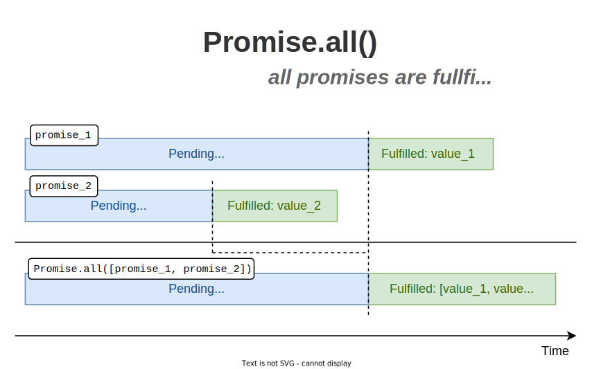
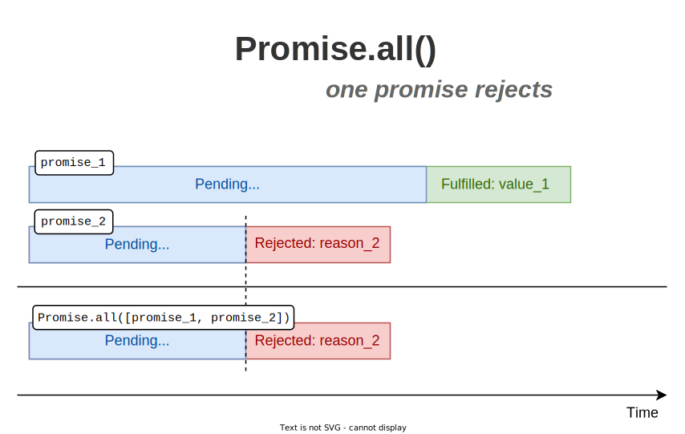

A [promise](/what-is-javascript-promise/) is a placeholder for a value that's going to be available sometime later. The promise helps handle asynchronous operations.  

JavaScript provides a helper function `Promise.all(promisesArrayOrIterable)` to handle multiple promises at once, in parallel, and get the results in a single aggregate array. Let's see how it works.  

<Affiliate type="traversyJavaScript" />

## 1. Promise.all()

`Promise.all()` is a built-in helper that accepts an array of promises (or generally an iterable). The function returns a promise from where you can extract promises resolved values using a `then`-able syntax: 

```javascript
const allPromise = Promise.all([promise1, promise2]);

allPromise.then(values => {
  console.log(values); // [resolvedValue1, resolvedValue2]
}).catch(error => {
  console.log(error); // rejectReason of any first rejected promise
});
```

In the case of `async/await` syntax:

```javascript
const allPromise = Promise.all([promise1, promise2]);

try {
  const values = await allPromise;
  console.log(values); // [resolvedValue1, resolvedValue2]
} catch (error) {
  console.log(error); // rejectReason of any first rejected promise
}
```

The interesting part is in the way the promise returned by `Promise.all()` gets resolved or rejected.  

<u>If all promises are resolved successfully</u>, then `allPromise` fulfills with an array containing fulfilled values of the promises. The order of promises in the array does matter &mdash; you'll get the fulfilled values in the same order.  



<u>But if at least one promise rejects</u>, then `allPromise` rejects right away (without waiting for the remaining pending promises to resolve) for the same reason.  



Let's see some examples.  

## 2. Example: all promises fulfilled

To study how `Promise.all()` works, I'm going to use 2 helpers &mdash; `resolveTimeout(value, delay)` and `rejectTimeout(reason, delay)`.  

```javascript
function resolveTimeout(value, delay) {
  return new Promise(
    resolve => setTimeout(() => resolve(value), delay)
  );
}

function rejectTimeout(reason, delay) {
  return new Promise(
    (r, reject) => setTimeout(() => reject(reason), delay)
  );
}
```

`resolveTimeout(value, delay)` returns a promise that fulfills with `value` after passing `delay` time.  

`rejectTimeout(reason, delay)`, however, returns a promise that rejects with `reason` (usually an error) after passing `delay` time.  

Let's access, at the same time, the lists of vegetables and fruits available at the local grocery store. Accessing each list is an asynchronous operation:  

```javascript{0-3}
const allPromise = Promise.all([
  resolveTimeout(['potatoes', 'tomatoes'], 1000),
  resolveTimeout(['oranges', 'apples'], 1000)
]);

// wait...
const lists = await allPromise;

// after 1 second
console.log(lists); 
// [['potatoes', 'tomatoes'], ['oranges', 'apples']]
```

[Open the demo.](https://codesandbox.io/s/all-promises-fullfilled-2wte0?file=/src/index.js)

`const allPromise = Promise.all([...])` returns a new promise `allPromise`. 

`const lists = await allPromise` awaits 1 second until `allPromise` fulfills with an array containing the first and second promises fulfill values.  

Finally, `lists` contains the aggregated result: `[['potatoes', 'tomatoes'], ['oranges', 'apples']]`.  

Note that the order of the values in the aggregated result corresponds to the order of the promises in the array supplied to `Promise.all()`:

```javascript
const [resolvedOfPromise1, resolvedOfPromise2] = Promise.all([promise1, promise2])
```

## 3. Example: one promise rejects

Now imagine the situation the grocery is out of fruits. Let's reject the fruits promise with an error `new Error('Out of fruits!')`:

```javascript{2,10}
const allPromise = Promise.all([
  resolveTimeout(['potatoes', 'tomatoes'], 1000),
  rejectTimeout(new Error('Out of fruits!'), 1000)
]);

try {
  // wait...
  const lists = await allPromise;
} catch (error) {
  // after 1 second
  console.log(error.message); // 'Out of fruits!'
}
```

[Open the demo.](https://codesandbox.io/s/one-rejects-w5guk?file=/src/index.js)

In this scenario `allPromise = Promise.all([...])` returns, as usual, a promise. 

After 1 second the second promise rejects with an error `new Error('Out of fruits!')`. This makes `allPromise` reject right away with the same `new Error('Out of fruits!')`.  

Even if the vegetables' promise has been fulfilled, `Promise.all()` doesn't take it into account.  

Such behavior of `Promise.all([...])` is named *fail-fast*. If at least one promise in the promises array rejects, then the promise returned by `allPromise = Promise.all([...])` rejects too &mdash; for the same reason.    

## 4. Conclusion

`Promise.all([...])` is a useful helper function that lets you execute asynchronous operations in parallel, using a fail-fast strategy, and aggregate the results into an array.  

*How often do you use `Promise.all()`?*