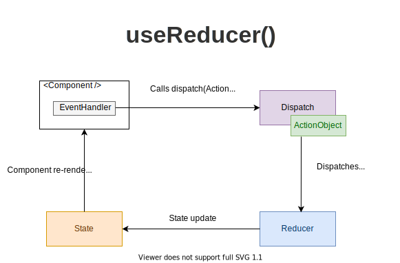

If you've used `useState()` hook to manage non-trivial state like a list of items, where you need to add, update and remove items in the state, you might have noticed that the state management logic takes a good part of the component body.  

That's a problem because the React component in nature should contain the logic that calculates the output. But the state management
logic is a different concern that should be managed in a separate place. Otherwise, you get a mix of state management and rendering logic in one place, 
and that's difficult to read, maintain, and test!  

To help you separate the concerns (rendering and state management) React provides the hook `useReducer()`. The hook does so by extracting the state management out of the component.  

Let's see how the `useReducer()` hook works. As a nice bonus, you will find in the post a real-world example that greatly helps undersanding how reducers work.   

*Before I go on, let me recommend something to you.* 

*If you want to significantly improve your React knowledge, take the  fantastic ["React Front To Back Course"](https://www.traversymedia.com/a/2147528895/FqXWyazh) by Brad Traversy. Use the coupon code "DMITRI" and get up to 20% discount!*

<TableOfContents maxLevel={3} />

## 1. useReducer()

The `useReducer(reducer, initialState)` hook accept 2 arguments: the *reducer* function and the *initial state*. The hook then returns an array of 2 items: the current state and the *dispatch* function.

```jsx
import { useReducer } from 'react';

function MyComponent() {
  const [state, dispatch] = useReducer(reducer, initialState);

  const action = {
    type: 'ActionType'
  };

  return (
    <button onClick={() => dispatch(action)}>
      Click me
    </button>
  );
}
```

Now, let's decipher what the terms of *initial state*, *action object*,  *dispatch*, and *reducer* mean.  

#### A. Initial state

> The *initial state* is the value the state is initialized with. 

For example, in the case of a counter state, the initial value could be:  

```javascript
// initial state
const initialState = { 
  counter: 0 
};
```

#### B. Action object

> An *action object* is an object that describes how to update the state.  

Typically, the action object would have a property `type` &mdash; a string describing what kind of state update the reducer must do.  

For example, an action object to increase the counter can look as follows:

```javascript
const action = {
  type: 'increase'
};
```

If the action object must carry some useful information (aka payload) to be used by the reducer, then you can add additional properties to the action object. 

For example, here's an action object to add a new user to an array of users state:

```javascript
const action = {
  type: 'add',
  user: { 
    name: 'John Smith',
    email: 'jsmith@mail.com'
  }
};
```

`user` is a property that holds the information about the user to add.  

#### C. Dispatch function

> The *dispatch* is a special function that dispatches an action object.  

The dispatch function is created for you by the `useReducer()` hook: 

```javascript
const [state, dispatch] = useReducer(reducer, initialState);
```

Whenever you want to update the state (usually from an event handler or after completing a fetch request), you simply call the dispatch function with the appropriate action object: `dispatch(actionObject)`.  

#### D. Reducer function

> The *reducer* is a pure function that accepts 2 parameters: the *current state* and an *action object*. Depending on the action object, the reducer function must update the state in an immutable manner, and return the new state.  

The following reducer function supports the increase and decrease of a counter state:

```javascript
function reducer(state, action) {
  let newState;
  switch (action.type) {
    case 'increase':
      newState = { counter: state.counter + 1 };
      break;
    case 'descrease':
      newState = { counter: state.counter - 1 };
      break;
    default:
      throw new Error();
  }
  return newState;
}
```

The reducer above doesn't modify directly the current state in the `state` variable, but rather creates a new state object stored in `newState`, then returns it.  

React checks the difference between the new and the current state to determine whether the state has been updated, so do not mutate the current state directly.  

#### E. Wiring everything

Wiring all these terms together, here's how the state update using a reducer works.  



As a result of an event handler or after completing a fetch request, you call the *dispatch* function with the *action object*. 

Then React redirects the action object and the current state value to the *reducer* function.

The reducer function uses the action object and performs a state update, returning the new state.  

React then checks whether the new state differs from the previous one. If the state has been updated, React re-renders the component and `useReducer()` returns the new state value: `[newState, ...] = useReducer(...)`.  

Note that `useReducer()` design is based on the [Flux architecture](https://facebook.github.io/flux/docs/in-depth-overview).  

If all these terms sound too abstract, then you have the right feeling! Let's see how `useReducer()` works in an interesting example.  

## 2. Implementing a stopwatch

The task is to implement a stopwatch. The stopwatch has 3 buttons: Start, Stop and Reset, and has a number displaying the passed seconds.  

Now let's think about structuring the state of the stopwatch. 

There are 2 important state properties: a boolean indicating whether the stopwatch runs (let's name it `isRunning`) and a number indicating the number of passed seconds (let's name it `time`). As result, here's how the *initial state* can look like:

```javascript
const initialState = {
  isRunning: false,
  time: 0
};
```

The initial state indicates that the stopwatch starts as inactive and at `0` seconds.  

Then let's consider what *action objects* the stopwatch should have. It's easy to find that we need 4 kinds of actions: to start, stop and reset the stopwatch running process, as well as tick the time each second.  

```javascript
// The start action object
{ type: 'start' }

// The stop action object
{ type: 'stop' }

// The reset action object
{ type: 'reset' }

// The tick action object
{ type: 'tick' }
```

Having the state structure, as well as the possible actions, let's use the *reducer* function to define how the action objects update the state:

```javascript
function reducer(state, action) {
  switch (action.type) {
    case 'start':
      return { ...state, isRunning: true };
    case 'stop':
      return { ...state, isRunning: false };
    case 'reset':
      return { isRunning: false, time: 0 };
    case 'tick':
      return { ...state, time: state.time + 1 };
    default:
      throw new Error();
  }
}
```

Finally, here's the component `Stopwatch` that wires everything together by invoking the `useReducer()` hook:

```jsx
import { useReducer, useEffect, useRef } from 'react';

function Stopwatch() {
  const [state, dispatch] = useReducer(reducer, initialState);
  const idRef = useRef(0);

  useEffect(() => {
    if (!state.isRunning) { 
      return; 
    }
    idRef.current = setInterval(() => dispatch({type: 'tick'}), 1000);
    return () => {
      clearInterval(idRef.current);
      idRef.current = 0;
    };
  }, [state.isRunning]);
  
  return (
    <div>
      {state.time}s
      <button onClick={() => dispatch({ type: 'start' })}>
        Start
      </button>
      <button onClick={() => dispatch({ type: 'stop' })}>
        Stop
      </button>
      <button onClick={() => dispatch({ type: 'reset' })}>
        Reset
      </button>
    </div>
  );
}
```

[Try the demo.](https://codesandbox.io/s/use-reducer-stopwatch-d1ocz?file=/src/Stopwatch.js)

The click event handlers of the Start, Stop, and Reset buttons correspondingly use the `dispatch()` function to dispatch the necessary action object. 

Inside the `useEffect()` callback, if `state.isRunning` is `true`, the `setInterval()` timer function dispatches the tick action object each second `dispatch({type: 'tick'})`.  

Each time the `reducer()` function updates the state, the component re-renders as a result and receives the new state.  

## 3. Reducer mental model

To solidify your knowledge even more, let's see a real-world example that works similarly to a reducer.  

Imagine you're the captain of a ship in the first half of the 20th century.  


The captain's bridge has a special communication device called *engine order telegraph* (see the picture above). This communication tool is used to transmit commands from the bridge to the engine room. Typical commands would be to move *back slowly*, move *ahead half* power, *stop*, etc.  

You're on the bridge and the ship is at full stop. You (the captain) want the ship to move forward at full speed. You'd approach the engine order telegraph and set the handle to *ahead full*. The engineers in the engine room, having the same device, see the *ahead full* command, and set the engine to the corresponding regime.  

The *engine order telegraph* is the *dispatch* function, the *commands* are the *action objects*, the *engineers in the engine room* are the *reducer* function, and the *engine regime* is the *state*.  

The engine order telegraph helps separate the bridge from the engine room. The same way the `useReducer()` hook helps separate the rendering from the state management logic.  

## 4. Conclusion

The `useReducer()` hook in React lets you separate the state management from the rendering logic of the component.  

`const [state, dispatch] = useReducer(reducer, initialState)` accepts 2 argument: the reducer function and the initial state. Also, the reducer returns an array of 2 items: the current state and the dispatch function.  

When you'd like to update the state, simply call `dispatch(action)` with the appropriate action object. The action object is then forwarded to the `reducer()` function that updates the state. If the state has been updated by the reducer, then the component re-renders, and `[state, ...] = useReducer(...)` hook returns the new state value.  

`useReducer()` fits great with relatively complex state update (requiring at least 2-3  update actions). For simple state management, simply use `useState()`.  

*Challenge: write a custom hook `myUseState()` that works exactly `useState()`, only that it uses the `useReducer()` hook to manage the state. Write your solution in a comment below!*
