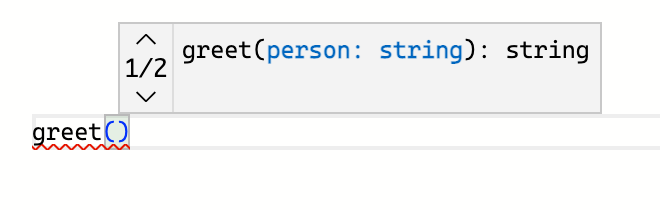
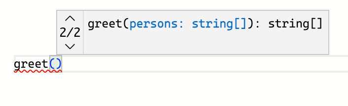

Most of the functions accept a fixed set of arguments. 

But some functions can accept a variable number of arguments, arguments of different types, or could return different types depending on how you invoke the function. 

To annotate such function TypeScript offers the function overloading feature. Let's see how function overloading works.  

<TableOfContents />

## 1. The function signature

Let's consider a function that returns a welcome message using a person's name:

```twoslash include greet
function greet(person: string): string {
  return `Hello, ${person}!`;
}
```

```ts twoslash
// @include: greet
```

The function above accepts 1 argument of type `string`: the name of the person.

Invoking the function is pretty simple:

```ts twoslash
// @include: greet
// ---cut---
greet('World'); // 'Hello, World!'
```

What about making `greet()` function more flexible? For example, make it additionally accept a list of persons to greet.  

Such a function should accept a string or an array of strings as an argument, as well as return a string or an array of strings.  

How to annotate such a function? There are 2 approaches.  

The first approach is straightforward and involves modifying the function signature directly by updating the parameter and return types:  

```twoslash include greet-signature
function greet(person: string | string[]): string | string[] {
  if (typeof person === 'string') {
    return `Hello, ${person}!`;
  } else if (Array.isArray(person)) {
    return person.map(name => `Hello, ${name}!`);
  }
  throw new Error('Unable to greet');
}
```

Here's how `greet()` looks after updating the parameter and return types:

```ts twoslash
// ---cut---
// @include: greet-signature
```

Now you can invoke `greet()` in 2 ways:

```ts twoslash
// @include: greet-signature
// ---cut---
greet('World');          // 'Hello, World!'
greet(['Jane', 'Joe']); // ['Hello, Jane!', 'Hello, Joe!']
```

Updating the function signature directly to support the multiple ways of invocation is a viable approach.  

But you can take an alternative approach and define separately all the ways your function can be invoked.  This approach in TypeScript is called *function overloading*.  

## 2. The function overloading

The second approach is to use the *function overloading* feature. I recommend it when the function signature is relatively complex and has multiple types involved.  

Putting the function overloading in practice requires defining a few *overload signatures* and one *implementation signature*.  

> *The overload signature* defines the parameter and return types of the function, and doesn't have a body. 

A function can have multiple overload signatures: corresponding to the different ways you can invoke the function.  

> *The implementation signature* has more generic parameter and return types, but also has a body that implements the function. 

There can be only *one* implementation signature.   

Let's transform the function `greet()` to use the function overloading:

```twoslash include greet-overloading
// Overload signatures
function greet(person: string): string;
function greet(persons: string[]): string[];

// Implementation signature
function greet(person: unknown): unknown {
  if (typeof person === 'string') {
    return `Hello, ${person}!`;
  } else if (Array.isArray(person)) {
    return person.map(name => `Hello, ${name}!`);
  }
  throw new Error('Unable to greet');
}
```

```ts twoslash
// @include: greet-overloading
```

The `greet()` function has 2 overload signatures and one implementation signature.  

Each overload signature describes one way the function can be invoked. In the case of `greet()` function, you can call it 2 ways: with a string argument, or with an array of strings as argument.  

The implementation signature `function greet(person: unknown): unknown { ... }` contains the proper logic how the function works.    

Now, as before, you can invoke `greet()` with the arguments of type string or array of strings:

```ts twoslash
// @include: greet-overloading
// ---cut---
greet('World');          // 'Hello, World!'
greet(['Jane', 'Joe']);  // ['Hello, Jane!', 'Hello, Joe!']
```

### 2.1 Overload signatures are callable

While the implementation signature implements the function behavior, however, it is *not directly callable*. Only the overload signatures are callable.  

```ts twoslash
// @errors: 2769
// @include: greet-overloading
// ---cut---
greet('World');         // Overload signature is callable
greet(['Jane', 'Joe']); // Overload signature is callable

const someValue: unknown = 'Unknown';
greet(someValue);       // Implementation signature is NOT callable
```

In the example above you cannot call `greet()` function with an argument of type `unknown` (`greet(someValue)`), even if the implementation signature accepts `unknown` argument.  

### 2.2 The implementation signature must be general

Be aware that the implementation signature type should be generic enough to include the overload signatures.  

Otherwise, TypeScript won't accept the overload signature as being incompatible. 

For example, if you modify the implementation signature's return type from `unknown` to `string`:

```ts twoslash
// @errors: 2394 2322
// Overload signatures
function greet(person: string): string;
function greet(persons: string[]): string[];

// Implementation signature
function greet(person: unknown): string {
  // ...
  throw new Error('Unable to greet');
}
```

Then the overload signature `function greet(persons: string[]): string[]` is marked as being incompatible with `function greet(person: unknown): string`.  

`string` return type of the implementation signature isn't general enough to be compatible with `string[]` return type of the overload signature.  

## 3. Method overloading

In the previous examples the function overloading was applied to a regular function. But you can overload methods too! 

During method overloading, both the overload signatures and implementation signature are now a part of the class.  

For example, let's implement a `Greeter` class, with an overload method `greet()`:

```twoslash include greeter
class Greeter {
  message: string;

  constructor(message: string) {
    this.message = message;
  }

  // Overload signatures
  greet(person: string): string;
  greet(persons: string[]): string[];

  // Implementation signature
  greet(person: unknown): unknown {
    if (typeof person === 'string') {
      return `${this.message}, ${person}!`;
    } else if (Array.isArray(person)) {
      return person.map(name => `${this.message}, ${name}!`);
    }
    throw new Error('Unable to greet');
  }
}
```

```ts twoslash
// @include: greeter
```

The `Greeter` class contains  `greet()` overload method: 2 overload signatures describing how the method can be called, and the implementation signature containing the proper implementation.  

Thanks to method overloading you can call `hi.greet()` in 2 ways: using a string or using an array of strings as argument.    

```ts twoslash
// @include: greeter
// ---cut---
const hi = new Greeter('Hi');

hi.greet('Angela');       // 'Hi, Angela!'
hi.greet(['Pam', 'Jim']); // ['Hi, Pam!', 'Hi, Jim!']
```

## 4. When to use function overloading

Function overloading, when used the right way, simplifies the use of functions that may be invoked in multiple ways. That is especially useful during autocomplete: you get listed all the possible overloadings as separate records.  





However, there are situations when I'd recommend not to use the function overloading, but rather stick to the function signature.  

For example, don't use the function overloading for optional parameters:

```ts
// Not recommended
function myFunc(): string;
function myFunc(param1: string): string;
function myFunc(param1: string, param2: string): string;

function myFunc(...args: string[]): string {
  // implementation...
}
```

Using the optional parameters in the function signature should be enough:

```ts
// OK
function myFunc(param1?: string, param2?: string): string {
  // implementation...
}
```

For more details check [Function overloading Do's and Don'ts](https://www.typescriptlang.org/docs/handbook/declaration-files/do-s-and-don-ts.html#function-overloads).

## 5. Conclusion

Function overloading in TypeScript lets you define functions that can be called in multiple ways.  

Using function overloading requires defining the overload signatures: a set of functions with parameter and return types, but without a body. These signatures indicate how the function should be invoked.  

Additionally, you have to write the proper implementation of the function (implementation signature): the parameter and return types, as well the function body. Note that the implementation signature is not callable.   

Aside from regular functions, methods in classes can be overload too.  

*How often do you use function overloading in TypeScript?*