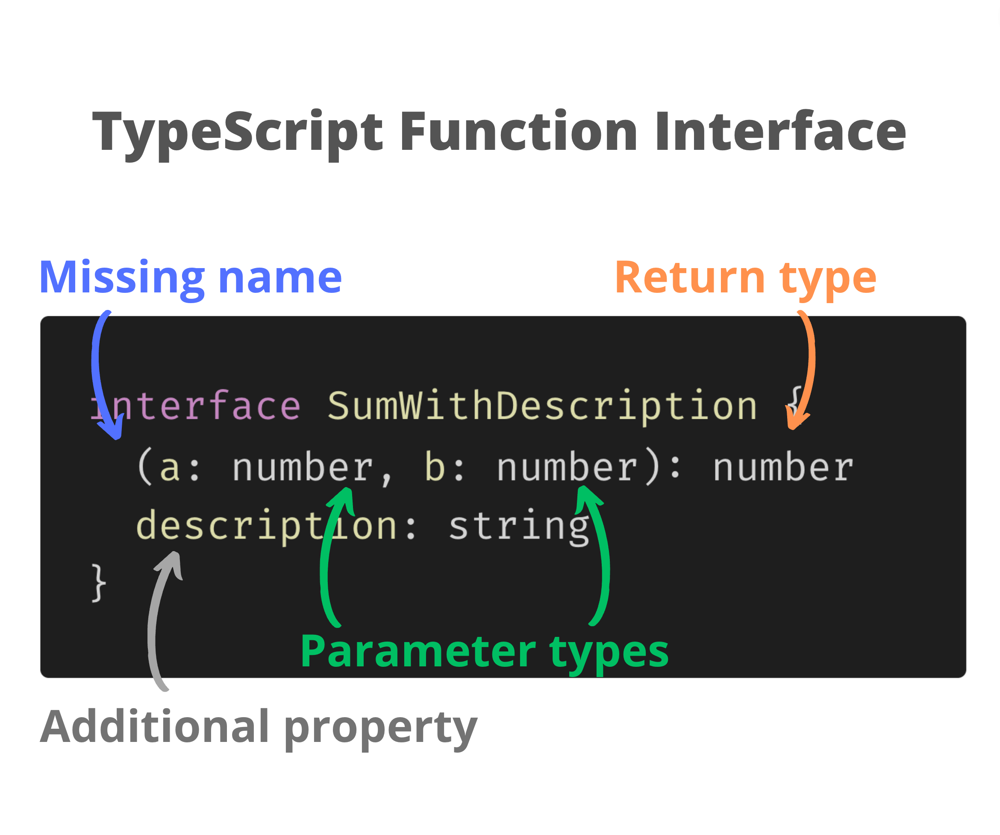

Functions are the small pieces of logic that together form applications. If you write applications in TypeScript, understanding function types is a must. 

This guide covers everything you need to know to get started with TypeScript function types.  

<TableOfContents maxLevel={1} />

## 1. TypeScript function type

Functions in JavaScript/TypeScript are [first-class objects](https://developer.mozilla.org/en-US/docs/Glossary/First-class_Function). You can assign functions to variables, use functions as arguments to other functions, and even return functions.  

Knowing how to type functions in TypeScript is a must if you want to pass functions around as objects.  

Let's start with a simple case: a function that sums 2 numbers.  

Here's the function in plain JavaScript:

```javascript
// JavaScript
function sum(a, b) {
  return a + b
}
```

`sum()` is a function that returns the sum of the parameters `a` and `b`.  

In plain JavaScript, you know that the parameters `a` and `b` must be numbers, and the returned value must also be a number.  

```javascript
// JavaScript
function sum(a, b) {
  return a + b
}

console.log(sum(4, 3)); // logs 7
```

In the example above the arguments `4` and `3`, as well as the returned value `7` are all *numbers*.  

Now that you have the parameter and return type information, you can easily translate this into a *TypeScript function type* of the `sum()`:

```typescript
// TypeScript function type
(a: number, b: number) => number
```

`(a: number, b: number)` is the part that specifies the parameters and their types. After the fat arrow indicate the return type: `=> number`. That's it.  

(Note: the function type looks similar to an [arrow function](/6-ways-to-declare-javascript-functions/#4-arrow-function). But they are different things.)

Because of their length, working with function types is more convenient if you store them into a [type alias](https://www.digitalocean.com/community/tutorials/typescript-type-alias#step-2-using-type-alias). An alias allows the type to be reused in multiple places:

```typescript
// Sum is a type alias
type Sum = (a: number, b: number) => number
```

Having the `Sum` type, you can use it to annotate any place where the function object is passed around.  

<ImgShadow>
  
</ImgShadow>

The first thing you can do, of course, is to assign the function to a variable:
```typescript
type Sum = (a: number, b: number) => number

// Assign to variable
const sum1: Sum = function(a: number, b: number): number { return a + b } // OK
const sum2: Sum = function(a, b) { return a + b } // OK
```
[Open the demo.](https://www.typescriptlang.org/play?#code/C4TwDgpgBAygrgWygXigCgIYC4oDtEBGEATgDRQE74JHECUKAfHoSQFBsD0nUAggM78AlgHNcUYAHsoANwzEhGAgBsIbAMaTc-YFH6IAjDnhJUAMzi51wIVsxVWZCg5ok6L2lADeUYhGBwxOIYUADUFFAAvlDcUADyANIaWjp6iABMxogoUBZWNnYY5AQMPn4BQVAh4QRRMTyJQA)

In the example above `sum1` and `sum2` are of type `Sum`. 

`sum2` function doesn't have the parameter and return types indicated: this is because TypeScript [infers](https://www.typescriptlang.org/docs/handbook/type-inference.html) these types from the `Sum`. 

I recommend using type inference in your code to avoid repetition, e.g. label your functions as I did with `sum2` instead of `sum1`. In the following examples I'm going to use type inference.  

In case of a [higher-order function](/javascript-higher-order-functions/), you use the function object as an argument or even return it from another function:

```typescript{3,9}
type Sum = (a: number, b: number) => number

// Sum as argument
function someFunc1(func: Sum): void {
  func(1, 2)
}
someFunc1((a, b) => a + b) // OK

// Sum returned
function someFunc2(): Sum {
  return (a, b) => a + b
}
someFunc2()(1, 2) // OK
```
[Open the demo.](https://www.typescriptlang.org/play?#code/C4TwDgpgBAygrgWygXigCgIYC4oDtEBGEATgDRQE74JHECUKAfHoSQFBsD0nsiUGAZ37EA5ogi5gbAGZxcAY2ABLAPa4oAlQggAxOfICMaWQpzwEdHADcVSgCZQA3myhQT8tAfIAmOmwC+bJraegpGmOQEDMjMGFAA1BQM3FAA8gDSHCnmUMQQwHDEuBB2MvrKahpauvreaJa8SM6ueQVF6BiR0bEJFAFB1aHydXSePsk8GUA)

## 2. TypeScript function type guide

To help you better understand how to use the function types, let's look at some guiding ideas.  

*1) Use `?` to indicate an optional parameter:*

```typescript
type SumOpt = (a: number, b?: number) => number

const sumOpt: SumOpt = function sum(a, b) {
  if (b === undefined) {
    return a
  }
  return a + b
}

sumOpt(2) // OK
```
[Open the demo.](https://www.typescriptlang.org/play?#code/C4TwDgpgBAygrgWwPJmFAvFAFAQwFxQB2iARhAE4A0UJA-AcQmeQJQYB8RpFAUDwMYB7QgGc0IxCmAF4yVBigAzOIX7AAlsKgSEuaiTYBvHlCjrF2EhnSYVAEwiL1hCHaMnTUchGBxyhKBwPAF8Pb19-QKgAahoeUJ4dKSwAJjYAenSoJABpIA)

`b?` in `SumOpt` function type is an optional parameter. The second argument can be omitted when invoking `sumOpt(2)`.  

*2) A rest parameter is typed using the three dots and an array type:*

```typescript
type SumRest = (...numbers: number[]) => number

const sumRest: SumRest = function sum(...numbers) {
  return numbers.reduce((sum, number) => sum + number)
}
sumRest(1, 2) // OK
```
[Open the demo.](https://www.typescriptlang.org/play?#code/C4TwDgpgBAygrgWwEoQM7CgXigCgHQEB2iARhAE6oBcUxCZ5A2gLoCUWAfLaRQFC8BjAPaF0UVIhToa8ZGgzYAZnEIDgASxHjE+Ij0rsA3ryhRyEYHHKFu9CqjzmAJnAEQcOCQgA0thu0wuLygAaj8KVl4AX14vKWAcAEZfACZ2AHp0qAB5AGkgA)

`...numbers: number[]` inside of the function type indicates a rest parameter.  

*3) The regular and the arrow functions have the same type:*

```typescript
type Sum = (a: number, b: number) => number

const regularFunc: Sum = function(a, b) { return a + b } // OK
const arrowFunc: Sum   = (a, b) => a + b                 // OK
```
[Open the demo.](https://www.typescriptlang.org/play?#code/C4TwDgpgBAygrgWygXigCgIYC4oDtEBGEATgDRQE74JHECUKAfHoSQFBsDGA9rgM7AoxCAHM4AGwzEAYnFycc8JKgBmczsACWvTOQIMA3kIjA4xXFAxQA1BSgBfKAHonUAPIBpLrwGXixbgB3WXlFRBR0DD0GZGYrWwIoJOSU1JSXdw8gA)


`regularFunc` is a [regular function](/6-ways-to-declare-javascript-functions/#2-function-expression) and `arrowFunc` is an [arrow function](/6-ways-to-declare-javascript-functions/#4-arrow-function). Both are `Sum` types.  

*4) The parameter names in the function type and the function instance can be different:*

```typescript
type Sum = (a: number, b: number) => number

const sumDiffParam: Sum = function(n1, n2) { return n1 + n2 } // OK
```
[Open the demo.](https://www.typescriptlang.org/play?#code/C4TwDgpgBAygrgWygXigCgIYC4oDtEBGEATgDRQE74JHECUKAfHoSQFBsDGA9rgM7AofRABEAlgDMJABQzEMCHPCSoJcXJ2BjeaXAEZyuAEwMA3lGIRgcYrjx6oAajxGoAXygB6T1ADyAaSA)

It's acceptable for the function type to have the parameter names `a` and `b`, but the function instance parameters `n1` and `n2`.  

*5) The function instance can have fewer parameters than the function type:*

```typescript 
type Sum = (a: number, b: number) => number

const sumShort: Sum = function (a) { return a } // OK
const sumShorter: Sum = function () { return 0 }  // OK
```
[Open the demo.](https://www.typescriptlang.org/play?#code/C4TwDgpgBAygrgWygXigCgIYC4oDtEBGEATgDRQE74JHECUKAfHoSQFBsDGA9rgM7AofRDAAW3YsBzwkqAGZxcnYAEte6DAwDeUYhGBxiuKBigBfKAHpLUAPIBpLrwFCR4ySWmIUUBUtXqaNq6+obGAAzmUFY2DkA)

`sumShort` and `sumShorter` have fewer parameters than the type `Sum` but are still of type `Sum`.  

However, the function instance cannot have more parameters than the function type:

```typescript 
type Sum = (a: number, b: number) => number

const sumLonger: Sum = function (a, b, c) { return a + b + c }  // Type error!
```
[Open the demo.](https://www.typescriptlang.org/play?#code/C4TwDgpgBAygrgWygXigCgIYC4oDtEBGEATgDRQE74JHECUKAfHoSQFBsDGA9rgM7AofRABleAcxI54SVADM4uTsACWvdBnIFynBgG8oxCMDjFcUDFADUFa1E5QAvlCgB6V1AAq4aCWLdiAEIgA)

*6) The return type of an async function must be a promise `Promise<T>`:*

```typescript
type SumAsync = (a: number, b: number) => Promise<number>

const sumAsync: SumAsync = async function (a, b) { 
  return await a + b
} // OK
```
[Open the demo.](https://www.typescriptlang.org/play?#code/C4TwDgpgBAygrgWwIIGcQDsDGUC8UAUAhgFxTqIBGEATgDRQWnkJXUCUuAfFAArUD2CAJYoIAHmatOAKGmZ+6FMCgpEqDJlLxkaLLiiFd2AGZwswIQoKF6FDgG8o0qFGoRgcaugMB3QkOVCKABqBmkAXygAeiioAHkAaSA)

`sumAsync` is an async function. The return type of an async function must be a [promise](/what-is-javascript-promise/) &mdash; `Promise<T>` type (which is a [generic type](https://www.typescriptlang.org/docs/handbook/2/generics.html)).  

## 3. TypeScript method type

A [method](/javascript-method/) is a function that exists and is executed in the context of an object. Method types in TypeScript have to exist within the object type.  

You can define methods on [interfaces](https://www.typescriptlang.org/docs/handbook/2/objects.html): 

```typescript
interface ObjectWithMethod {
  sum(a: number, b: number): number
}
```

or even use a type alias:

```typescript
type ObjectWithMethod = {
  sum(a: number, b: number): number
}
```

`ObjectWithMethod` is an object type having a method `sum()`. The first and second parameter types `(a: number, b: number)` are numbers, and the return type `: number` is also a number.  

<ImgShadow>

</ImgShadow>

Note an important difference. The function type uses the fat arrow `=>` to separate the parameter list from the return type, while the method type uses the colon `:`.  

Let's look at a method type example:

```typescript
interface ObjectWithMethod {
  sum(a: number, b: number): number
}

const object: ObjectWithMethod = {  // OK
  sum(a, b) { return a + b }
}
```
[Open the demo.](https://www.typescriptlang.org/play?#code/JYOwLgpgTgZghgYwgAgPICMBWEFgOrBgAWAshMQPYAmyA3gFDLIDOArgLYAUcAXMiB3TQANMnR8B7IVACUEwdHoBfevQQUQzMMgpYcYPhmy4CxMpRoBeOkwD0ttAGlGLDt1HoZNqOVZQQyHDIANRiyCpKQA)

`object` is of type `ObjectWithMethod` and contains a method `sum()`.  

Of course, you can add many method types to an object type:

```typescript
interface ObjectWithMethod {
  sum(a: number, b: number): number
  product(a: number, b: number): number
  abs(a: number): number
  // etc...
}
```

## 4. TypeScript function interface

Another interesting way of writing a function type is to use a TypeScript function interface. It's also called function call signature (too scientific for me). 

The function interface looks a lot like to an object interface with a method. But the function interface *doesn't have the method name written*:  

```typescript
interface SumInterface {
  (a: number, b: number): number
}
```

`SumInterface` is a function interface. Note that before the expression `(a: number, b: number): number` there is no method name indicated.  

Let's use `SumInterface` to annotate a variable:

```typescript
interface SumInterface {
  (a: number, b: number): number
}

const sum: SumInterface = function(a, b) { return a + b } // OK
```
[Open the demo.](https://www.typescriptlang.org/play?#code/JYOwLgpgTgZghgYwgAgMoFcC2BJc15LIDeAUMsgBRwBcyIWARtADTIO32ZNQCUHj0EgF8SJBAHsQAZzDIpWWhhx5YiFAF5kMdCARhgkqqwY9iyKBDDooIZHGQBqNsiHIA9G+QB5ANJA)

Most of the time you will use the regular TypeScript function type `(a: number, b: number) => number` instead of a function interface. Mostly because a function type is shorter to write.   

But you can benefit from the function interface when you want to add properties to the function object. Let's add the property `description` to the function interface:

```typescript
interface SumWithDescription {
  (a: number, b: number): number
  description: string
}

const sum: SumWithDescription = function(a, b) {
  return a + b
}
sum.description = 'A function that sums two numbers'
```
[Open the demo.](https://www.typescriptlang.org/play?#code/JYOwLgpgTgZghgYwgAgMoFcC2B1YYAWAIhAM4JTAAOYwA9iMgN4BQyyAFHAFzIhYBG0ADTJ+PPpkFQAlOIHRWyACalyVGvR4kwFEAHNmAX2bME9bchJYeGHHiKqK1OgwC8yGOhAINITiP5pJkUoCDB0KAY4ZABqUSNmK0wAOhUyJ19kdwByAEEPLx8XZAI4MEssEhKAd1peeSgSbKA)

`SumWithDescription`, in addition to being a function, also has a `description` property of type `string`.  

<ImgShadow>

</ImgShadow>

## 5. Conclusion

Writing a function type is quite simple:

```typescript
type Sum = (a: number, b: number) => number
```

Specify the parameter types in a pair of parentheses, put the fat arrow `=>`, and the return type.  

For methods, you have to define the method on an object type:

```typescript
interface ObjectWithMethod {
  sum(a: number, b: number): number
}
```

Again, put the parameters into a pair of parentheses, then a colon `:` and finally indicate the return type.  

Now you should be able to type functions in your TypeScript code.  

How can you type a function that can be invoked in multiple ways? Follow the [TypeScript Function Overloading](/typescript-function-overloading/) post for more information.  

*Have any questions about function types? Leave a comment and let's discuss!*
