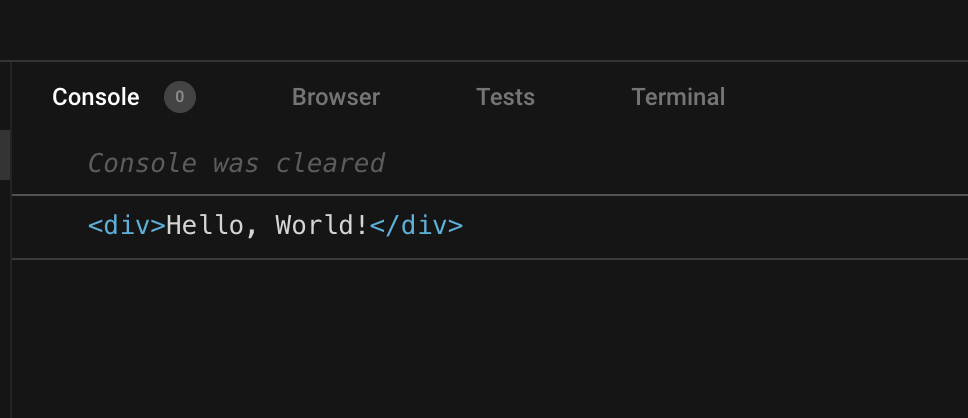

To access a DOM element rendered in the component's body you can use [use](/react-useref/#2-accessing-dom-elements) a ref, which is created by `useRef()` hook.  

But what if you need to access a DOM element of a child component? Then a simple ref is not enough and you have to combine refs with `React.forwardRef()`: a technique called *refs forwarding*.  

Moreover, `useImperativeHandle()` is a hook that increases the capabilities of `forwardRef()` by giving the parent component access to more goodies like multiple refs or imperative methods of a child component. 

Let's see how it works.  

<Affiliate type="traversyReact" />

<TableOfContents maxLevel={1} />

## 1. Refs in child components

There are situations when you have to work with the DOM because the existing React abstractions (components, state, props, hooks, context) do not cover all possible use cases:

* call methods on DOM elements to manage focus, scroll, and text selection
* integrate 3rd party scripts that are unaware of React abstractions
* working with animation libraries, for example [GSAP](https://greensock.com/react-basics#refs)

Let's recall how to access a DOM element directly from the body of the component:

```jsx
import { useRef, useEffect } from 'react'

export function Main() {
  const elementRef = useRef() // create the ref

  useEffect(() => {
    // after mounting
    console.log(elementRef.current) // logs HTMLDivElement
  }, [])

  return <div ref={elementRef}>Hello, World!</div> // assign the ref
}
```

[Open the demo.](https://codesandbox.io/s/competent-grass-89so21?file=/src/Main.jsx)

`const elementRef = useRef()` creates a ref. `elementRef` will contain after mounting the DOM element instance. You don't have to initialize the ref with any initial value.  

Then `elementRef` have to be assigned to the `ref` attribute of the tag which element you want to access: `<div ref="elementRef">`.  

Finally, after component mounting, `elementRef.current` contains the DOM element instance. When the component is mounted is [detected](react-useeffect-explanation/#31-component-did-mount) using `useEffect()` hook with an empty array as a dependency.  

Open the [demo](https://codesandbox.io/s/competent-grass-89so21?file=/src/Main.jsx) and you'll see the element logged to the console. 

Ok, then what is the limitation of this approach? A problem appears when the element is not rendered directly in the body of the component, but rather in a child component. The simple approach of using a ref does not work in this case. Let me show you why.  

Let's modify the previous example by extracting the `<div>Hello, World!</div>` into a child component `<HelloWorld>`. Also, let's create a prop `ref` on `<HelloWorld>`, to which `<Main>` assigns `elementRef`:

```jsx
import { useRef, useEffect } from 'react'

export function Main() {
  const elementRef = useRef()

  useEffect(() => {
    // Does not work!
    console.log(elementRef.current) // logs undefined
  }, [])

  return <HelloWorld ref={elementRef} /> // assign the ref
}

function HelloWorld({ ref }) { // a new component
  return <div ref={ref}>Hello, World!</div>
}
```
[Open the demo.](https://codesandbox.io/s/react-ref-dom-child-zztlg5?file=/src/Main.jsx)

Is this code working? Open the [demo](https://codesandbox.io/s/react-ref-dom-child-zztlg5?file=/src/Main.jsx) and you'll see that after mounting `elementRef.current` contains `undefined`. `<Main>` wasn't able to access the DOM element from the child component. 

React also throws a useful warning: `Warning: Function components cannot be given refs. Attempts to access this ref will fail. Did you mean to use React.forwardRef()?`

Let's follow React's advice and see how `forwardRef()` can help.  

## 2. Introducing forwardRef()

Now is the right moment to introduce `forwardRef()`: a function that wraps a component allowin it to access a ref from the parent component.

```javascript
import { forwardRef } from 'react'

const Component = forwardRef(function(props, ref) {
  return <div ref={ref} />
})
```

`forwardRef()` is a [higher-order function](/javascript-higher-order-functions/) that wraps a React component. The wrapped component works the same as the original component but also receives as the second parameter the `ref`.  

Let's wrap `<HelloWorld>` component into  `forwardRef()`:

```jsx {13-15}
import { useRef, useEffect, forwardRef } from 'react'

export function Main() {
  const elementRef = useRef()

  useEffect(() => {
    // Works!
    console.log(elementRef.current) // logs HTMLDivElement
  }, [])

  return <HelloWorld ref={elementRef} /> // assign the ref
}

const HelloWorld = forwardRef(function(props, ref) {
  return <div ref={ref}>Hello, World!</div>
})
```

[Open the demo.](https://codesandbox.io/s/react-ref-dom-forwardref-kyuklk?file=/src/Main.jsx)

Now the parent component can assign `elementRef` as a prop on the child component ` <HelloWorld ref={elementRef} />`. Then, thanks to being wrapped into `forwardRef`, `<HelloWorld>` component reads that ref from the second parameter and uses it on its element `<div ref={ref}>`.  

Open the [demo](https://codesandbox.io/s/react-ref-dom-forwardref-kyuklk?file=/src/Main.jsx). After mounting `elementRef.current` *contains* the DOM element from `<HelloWorld>` component. It works!



## 3. forwardRef() in TypeScript

Using `forwardRef()` in TypeScript is a bit trickier because you have to indicate the type arguments of `useRef<T>()` in the parent component and `forwardRef()<T, P>` wrapping the child component. Both functions are [generic function types]((https://www.typescriptlang.org/docs/handbook/2/generics.html#generic-types)).

`forwardRef<V, P>()` accepts 2 argument types:

1. `V` is the type of the value stored in a ref, which is usually an `HTMLDivElement` or `HTMLInputElement`
2. `P` is the props type of the component 

Same way `useRef<V>()` hook in TypeScript is a generic function type. Its single argument type is `V`: denoting the type of the value stored in the ref. If you store DOM elements in the ref, often `V` can be `HTMLDivElement` or `HTMLInputElement`.  

Now let's annotate the `<Main>` and `<HelloWorld>` components:

```tsx
import { useRef, forwardRef } from "react"

export function Main() {
  const elementRef = useRef<HTMLDivElement>(null)

  return <HelloWorld ref={elementRef} />
}

const HelloWorld = forwardRef<HTMLDivElement>(function (props, ref) {
  return <div ref={ref}>Hello, World!</div>
})
```
[Try the demo.](https://codesandbox.io/s/eloquent-burnell-3vrm0o?file=/src/Main.tsx)

`useRef<HTMLDivElement>(null)` creates a ref holding a div element because `HTMLDivElement` is used as a type argument.  

The ref is initialized with `null` &mdash; this is important to do. Othwerwise TypeScript [throws a type error](https://stackoverflow.com/a/69143200/1894471) when assigning the ref to the child component: `<HelloWorld ref={elementRef} />`.  

Finally, when wrapping the child component `forwardRef<HTMLDivElement>(...)` indicate `HTMLDivElement` as the type argument: which indicates what ref value is forwarded.  

## 4. forwardRef() and useImperativeHandle()

What if you want to access something else from the child component? For example a simple function to focus the input.  

That's when [useImperativeHandle()](https://react.dev/reference/react/useImperativeHandle) hook can help you.  

```jsx
import { forwardRef, useImperativeHandle } from 'react'

const MyComponent = forwardRef(function(props, ref) {
  useImperativeHandle(ref, function() {
    return {
      // new ref value...
    }
  }, []) // dependencies

  return <div>...</div>
}
```

`useImperativeHandle(ref, getRefValue, deps)` accepts 3 arguments: the forwarded `ref`, the function returning the ref value, and the dependencies array.  

For example, let's use the hook and give the parent just a method `focus()`:

```jsx
import { useRef, forwardRef, useEffect, useImperativeHandle } from "react"

export function Main() {
  const methodsRef = useRef()

  useEffect(() => methodsRef.current.focus(), [])

  return <FocusableInput ref={methodsRef} />
}

const FocusableInput = forwardRef(function (props, ref) {
  const inputRef = useRef()

  useImperativeHandle(ref, function () {
    return {
      focus() { inputRef.current.focus() }
    }
  }, [])

  return <input type="text" ref={inputRef} />
});

```
[Open the demo.](https://codesandbox.io/s/react-useimperativehandle-no2tli?file=/src/Main.jsx)


`useImperativeHandle(ref, ..., [])` gives the parent an object with a method `focus()`.  

After mounting, the parent calls `methodsRef.current.focus()` method, which focuses the input element in the child component.  

Finally, remember that `useImperativeHandle()` can be used only inside a component wrapped in `forwardRef()`.  

## 5. Favor declarative approach

Before ending the post, I advise you to keep the refs' usage at a minimum. Here's why.    

React is the library which goal is to abstract you from manipulating DOM, cross-browser compatibility, and DOM manipulation performance. React gives you wonderful components, props, state, hooks, and context abstractions to save you from dealing with DOM and browser-specific details.  

When deciding to use refs to access DOM, including with the help of `forwardRef()` and `useImperativeHandle()`, you do not use React abstractions, but directly the DOM-specific details. The code that uses many refs with DOM elements in the [long run is more difficult to maintain](https://blog.logrocket.com/why-you-should-use-refs-sparingly-in-production/).  

Consider using a React abstraction to achieve your goal before using a ref to access DOM. Of course, it's not always possible, and from time to time you have to get your hands dirty.

## 6. Conclusion

Accessing a DOM element instance is relatively easy when the element is rendered directly in the body of the component. Just assign the ref to the tag: `<div ref={elementRef} />`.  

Things become trickier when the element you need access to is rendered inside of a child component. In this case, you have to wrap the child component into the built-in React function `forwardRef()`:

```jsx
import { forwardRef } from 'react'

function Parent() {
  const elementRef = useRef()

  return <Child ref={elementRef} />
}

const Child = forwardRef(function(props, ref) {
  return <div ref={ref}>...</div>
})
```

`Parent` component safely assigns `elementRef` to the child component `<Child ref={elementRef} />`. After mounting, `elementRef` contains the DOM element instance of the child component.  

*What questions do you have about `forwardRef()`?*