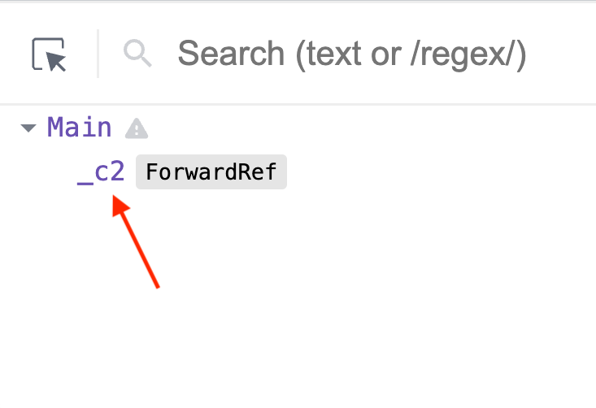
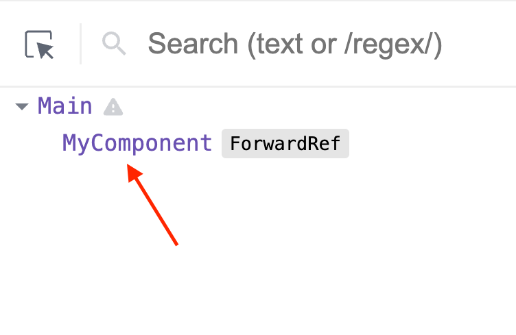

To access a DOM element rendered in the component's body you can [use](/react-useref/#2-accessing-dom-elements) a ref created by `useRef()` hook.  

But what if you need to access a DOM element of a child component? Then a simple ref is not enough and you have to combine refs with `React.forwardRef()`: a technique called *refs forwarding*.  

Also, `useImperativeHandle()` is a hook that extends the capabilities of `forwardRef()` by giving the parent component access to more goodies like imperative methods of a child component. 

Let's see how it works.  

<Affiliate type="traversyReact" />

<TableOfContents maxLevel={2} />

## 1. Refs in child components

There are situations when you have to work with the DOM because the existing React abstractions (components, state, props, hooks, context) do not cover all possible use cases:

* call methods on DOM elements to manage focus, scroll, and text selection
* integrate 3rd party scripts that are unaware of React abstractions
* working with animation libraries, for example [GSAP](https://greensock.com/react-basics#refs)

Let's recall how to access a DOM element directly from the body of the component:

```jsx
import { useRef, useEffect } from 'react'

export function Parent() {
  const elementRef = useRef() // create the ref

  useEffect(() => {
    // after mounting
    console.log(elementRef.current) // logs <div>Hello, World!</div>
  }, [])

  return <div ref={elementRef}>Hello, World!</div> // assign the ref
}
```

[Open the demo.](https://codesandbox.io/s/competent-grass-89so21?file=/src/Parent.jsx)

`const elementRef = useRef()` creates a [ref](/react-useref/). Then `elementRef` is assigned to the `ref` attribute of the tag: `<div ref="elementRef">`.  

`elementRef` after mounting will contain the DOM element instance (`useEffect()` hook with an empty array as deps [detects](/react-useeffect-explanation/#31-component-did-mount) when the component mounts).  

Open the [demo](https://codesandbox.io/s/competent-grass-89so21?file=/src/Parent.jsx) and you'll see the element logged to the console. 

Ok, so what is the limitation of this approach? A problem arises when the element is not rendered directly in the body of the component, but rather in a child component.  

Let's modify the previous example by extracting the `<div>Hello, World!</div>` into a child component `<Child>`. Also, let's create a prop `ref` on `<Child>`, to which `<Parent>` assigns `elementRef`:

```jsx
import { useRef, useEffect } from 'react'

export function Parent() {
  const elementRef = useRef()

  useEffect(() => {
    // Does not work!
    console.log(elementRef.current) // logs undefined
  }, [])

  return <Child ref={elementRef} /> // assign the ref
}

function Child({ ref }) { // a new component
  return <div ref={ref}>Hello, World!</div>
}
```
[Open the demo.](https://codesandbox.io/s/react-ref-dom-child-zztlg5?file=/src/Parent.jsx)

Is this code working? Open the [demo](https://codesandbox.io/s/react-ref-dom-child-zztlg5?file=/src/Parent.jsx) and you'll see that after mounting `elementRef.current` contains `undefined`. 

`<Parent>` couldn't access the DOM element from the child component. 


React also throws a useful warning: `Warning: Function components cannot be given refs. Attempts to access this ref will fail. Did you mean to use React.forwardRef()?`

Let's follow React's advice and see how `forwardRef()` can help.  

## 2. forwardRef()

Now is the right moment to introduce `forwardRef()`.  

`forwardRef()` is a [higher-order component](https://dev.to/nibble/higher-order-components-in-react-4c7h) that wraps a React component. The wrapped component works the same way as the original component but also receives as *the second parameter a `ref`: the forwarded ref from the parent component*.  


Let's wrap the child component into  `forwardRef()` with the goal to connect parent's `elementRef` with child's `<div>Hello, World!</div>`:

```jsx
import { useRef, useEffect, forwardRef } from 'react'

export function Parent() {
  const elementRef = useRef()

  useEffect(() => {
    // Works!
    console.log(elementRef.current) // logs <div>Hello, World!</div>
  }, [])

  return <Child ref={elementRef} /> // assign the ref
}

const Child = forwardRef(function(props, ref) {
  return <div ref={ref}>Hello, World!</div>
})
```

[Open the demo.](https://codesandbox.io/s/react-ref-dom-forwardref-kyuklk?file=/src/Parent.jsx)

The parent component assigns `elementRef` to the child component `<Child ref={elementRef} />`. Then, thanks to being wrapped into `forwardRef()`, the child component gets the ref from the second parameter and uses it on its element `<div ref={ref}>`.  

After mounting `elementRef.current` in the parent component *contains* the DOM element from child component. Open the [demo](https://codesandbox.io/s/react-ref-dom-forwardref-kyuklk?file=/src/Parent.jsx): it works!

That's the purpose of `forwardRef()`: give the parent component access to DOM elements in the child component.  

## 3. useImperativeHandle()

What if you want to access something else from the child component? For example, a simple function to focus the input.  

That's where [useImperativeHandle()](https://react.dev/reference/react/useImperativeHandle) hook can help you.  

```jsx
import { forwardRef, useImperativeHandle } from 'react'

const MyComponent = forwardRef(function(props, ref) {
  useImperativeHandle(ref, function getRefValue() {
    return {
      // new ref value...
      method1() { },
      method2() { }
    }
  }, []) // dependencies

  return <div>...</div>
}
```

`useImperativeHandle(ref, getRefValue, deps)` is built-in React hook that accepts 3 arguments: the forwarded `ref`, the function that returns the new ref value, and the dependencies array.  

The value returned of `getRefValue()` function becomes the value of the forwarded ref. That's the main benefit of `useImperativeHandle()`: you can customize the forwarded ref value with whatever you want.  


For example, let's use the hook and give the parent an object with methods `focus()` and `blur()`:

```jsx
import { useRef, forwardRef, useImperativeHandle } from 'react'

export function Main() {
  const methodsRef = useRef()

  const focus = () => methodsRef.current.focus()
  const blur = () => methodsRef.current.blur()

  return (
    <>
      <FocusableInput ref={methodsRef} />
      <button onClick={focus}>Focus input</button>
      <button onClick={blur}>Blur input</button>
    </>
  )
}

const FocusableInput = forwardRef(function (props, ref) {
  const inputRef = useRef()

  useImperativeHandle(ref, // forwarded ref
    function () {
      return {
        focus() { inputRef.current.focus() },
        blur() { inputRef.current.blur() }
      } // the forwarded ref value
    }, [])

  return <input type="text" ref={inputRef} />
})
```
[Open the demo.](https://codesandbox.io/s/react-useimperativehandle-no2tli?file=/src/Main.jsx)

`useImperativeHandle(ref, ..., [])` gives the parent an object with `focus()` and `blur()` methods.  

Finally, remember that `useImperativeHandle()` can be used only inside a component wrapped in `forwardRef()`.  

## 4. Deep refs forwarding

You can forward refs more than 1 level down in the component hierarchy. Just wrap each child, grandchild, and so on components in `forwardRef()`, and pass the ref down until you reach the target DOM element.  

Let's forward `elementRef` 2 times to access the DOM element from a grandchild component:

```jsx
import { forwardRef, useRef, useEffect } from "react";

export function Parent() {
  const elementRef = useRef()

  useEffect(() => {
    console.log(elementRef.current); // logs <div>Deep!</div>
  }, [])

  return <Child ref={elementRef} />
}

const Child = forwardRef(function (props, ref) {
  return <GrandChild ref={ref} />
})

const GrandChild = forwardRef(function (props, ref) {
  return <div ref={ref}>Deep!</div>
})
```
[Open the demo.](https://codesandbox.io/s/react-useimperativehandle-forked-0jzpnw?file=/src/Parent.jsx)

`elementRef` is forwarded to the child component, which then forwards the same ref to the grandchild, which finally connects the ref to `<div ref={ref}>Deep!</div>`.  

Using 2 forwards the parent component `elementRef` gets access to `<div ref={ref}>Deep!</div>` in the grandchild.  


As a side note, try to keep the forwarding to a minimum to avoid increasing the code complexity.  

## 5. Pitfalls

### 5.1 ref is undefined or null

If the forwarded ref is unexpectedly `undefined` or `null`, there are usually 2 reasons.  

First, you may have *forgotten to assign the forwarded ref to `ref` attribute of the HTML tag*:

```jsx{6,13}
import { useRef, useEffect, forwardRef } from 'react'

export function Parent() {
  const elementRef = useRef()

  useEffect(() => {
    console.log(elementRef.current) // logs undefined
  }, [])

  return <Child ref={elementRef} />
}

const Child = forwardRef(function(props, ref) {
  return <div>Hello, World!</div> // ref not assigned to ref attribute!
})
```
[Open the demo.](https://codesandbox.io/s/react-ref-dom-undefined-ebmzyl?file=/src/Parent.jsx)

`elementRef` in the example above is `undefined` because the forwarded ref isn't assigned to `ref` attribute of `<div>Hello, World!</div>` inside the child component.

To fix the problem just assign correctly the ref: `<div ref={ref}>Hello, World!</div>`.

Second, you may have *conditionally displayed the referenced DOM element*:

```jsx{23}
import { useRef, useEffect, forwardRef, useState } from 'react'

export function Parent() {
  const elementRef = useRef()
  const [show, setShow] = useState(true)

  const toggle = () => setShow(!show)

  useEffect(() => {
    // logs <div>Hello, World!</div> or null
    console.log(elementRef.current)
  }, [show])

  return (
    <>
      <button onClick={toggle}>Toggle</button>
      <Child ref={elementRef} show={show} />
    </>
  )
}

const Child = forwardRef(function({ show }, ref) {
  // displayed conditionally
  return show ? <div ref={ref}>Hello, World!</div> : null
})
```
[Open the demo.](https://codesandbox.io/s/react-ref-dom-condition-e1yi3m?file=/src/Parent.jsx)

The child component renders `<div ref={ref}>Hello, World!</div>` under a condition. Initially `show` prop is `true`, thus `elementRef` is `<div>Hello, World!</div>`.  

Clicking "Toggle" button makes `show` become `false`. This makes the ternary operator in `<Child>` render `null` &mdash; and not render the div element. Thus `elementRef` in the parent becomes `null`.  

### 5.2 Pass ref using a prop

In the [first section](#1-refs-in-child-components) I mentioned that if you assign to `ref` prop an actual ref, React will throw a warning `Warning: Function components cannot be given refs.`  

But what about using a custom prop, for example, `elementRef`, and passing the ref down to the child component using the custom prop?  

Let's take a look:

```jsx {10,13}
import { useRef, useEffect } from "react"

export function Parent() {
  const elementRef = useRef()

  useEffect(() => {
    // Works!
    console.log(elementRef.current); // logs <div>Hello, World!</div>
  }, [])

  return <Child elementRef={elementRef} />
}

function Child({ elementRef }) {
  return <div ref={elementRef}>Hello, World!</div>
}
```
[Open the demo.](https://codesandbox.io/s/react-ref-custom-prop-wf8t45?file=/src/Parent.jsx)

The parent component passes `elementRef` to `<Child elementRef={elementRef}>` using a custom prop `elementRef`. The child component then assigns `elementRef` prop to the tag: `<div ref={elementRef}>Hello, World!</div>`.

What's your bet, does `elementRef` in the parent component access the DOM element of the child? 

Indeed, it does!

Then the big question is... why bother with using `forwardRef()`? You can just pass the ref using a prop!

I don't recommend doing so, and here are 2 reasons.

First, using `ref` attribute (instead of a custom prop like `elementRef`) is better because it keeps the ref *API consistent* between class-based, function-based, and HTML tags. 

Second, props are [immutable](https://react.dev/learn/passing-props-to-a-component#recap) in React. Passing the ref using a prop violates the props immutability because the ref eventually is assigned (aka mutated) with the DOM element.   

*Do you know other issues when passing ref using a custom prop? Write a comment below!*

### 5.3 Anonymous component

An anonymous function doesn't have a name near `function` keyword. 

```javascript
import { forwardRef } from 'react'

const MyComponent = forwardRef(function() { // Anonymous function
  // ...
})
```

In React dev tools an anonymous function wrapped in `forwardRef()` results in a component with an unmeaningful name:

<ImgShadow>

</ImgShadow>

Having no component name in the hierarchy makes it hard to understand what is rendered on the page. In addition, you cannot use the search functionality of the React dev tools to find your component.  

To give a component a name use the [named function expressions](/6-ways-to-declare-javascript-functions/#21-named-function-expression) for components wrapped in `forwardRef()`:

```javascript
import { forwardRef } from 'react'

const MyComponent = forwardRef(function MyComponent() {// Named function
  // ...
})
```

Using `function MyComponent() {...}` displays the component name in React dev tools:

<ImgShadow>

</ImgShadow>

With the proper names of components, debugging the application is much easier.  

## 6. forwardRef() in TypeScript

React `forwardRef()` in TypeScript is a bit trickier because you need to specify the type arguments of `useRef<T>()` in the parent component and `forwardRef()<T, P>` wrapping the child component. Both functions are [generic function types]((https://www.typescriptlang.org/docs/handbook/2/generics.html#generic-types)).

`forwardRef<V, P>()` accepts 2 argument types:

1. `V` is the type of the value stored in a ref, which is usually an `HTMLDivElement` or `HTMLInputElement`
2. `P` is the props type of the wrapped component 

`useRef<V>()` hook in TypeScript has one argument type `V`: denoting the value type stored in the ref. If you store DOM elements in the ref, `V` can be `HTMLDivElement` or `HTMLInputElement`.  

Now let's annotate the parent and child components:

```tsx
import { useRef, forwardRef } from "react"

export function Parent() {
  const elementRef = useRef<HTMLDivElement>(null)

  return <Child ref={elementRef} />
}

const Child = forwardRef<HTMLDivElement>(function (props, ref) {
  return <div ref={ref}>Hello, World!</div>
})
```
[Open the demo.](https://codesandbox.io/s/eloquent-burnell-3vrm0o?file=/src/Parent.tsx)

`useRef<HTMLDivElement>(null)` creates a ref that holds a div element because `HTMLDivElement` is used as the type argument.  

The ref is initialised with `null` &mdash; this is important. Otherwise, TypeScript [throws a type error](https://stackoverflow.com/a/69143200/1894471) when assigning the ref to the child component: `<Child ref={elementRef} />`.  

Finally, when wrapping the child component `forwardRef<HTMLDivElement>(...)` specify `HTMLDivElement` as the value type of the forwarded ref.  

## 7. Conclusion

Before ending the post, I advise you to keep the use refs to a minimum. 

React is the library which goal is to abstract you from DOM manipulation, cross-browser compatibility, and DOM manipulation performance. React gives you wonderful components, props, state, hooks, and context abstractions to free you from dealing with DOM and browser-specific details.  

If you choose to use refs to access DOM, including with the help of `forwardRef()` and `useImperativeHandle()`, you are not using React abstractions, you are using the DOM-specific details directly. Code that uses a lot of refs with DOM elements will be harder to maintain in the [long run](https://blog.logrocket.com/why-you-should-use-refs-sparingly-in-production/).  

Consider using a React abstraction to achieve your goal before using a ref to access DOM. Of course, this isn't always possible, and you have to get your hands dirty from time to time.

Ok. 

In conclusion, accessing a DOM element instance is relatively easy when the element is rendered directly in the body of the component. Just assign the ref to the tag: `<div ref={elementRef} />`.  

Things get trickier when the element is rendered inside of a child component. In this case, you have to wrap the child component into the built-in React function `forwardRef()`:

```jsx
import { forwardRef } from 'react'

function Parent() {
  const elementRef = useRef()

  return <Child ref={elementRef} />
}

const Child = forwardRef(function(props, ref) {
  return <div ref={ref}>...</div>
})
```

The parent component safely assigns `elementRef` to the child component `<Child ref={elementRef} />`. After mounting, `elementRef` contains the DOM element instance of the child component.  

*Do you think React should support refs forwarding natively, without the use of `forwardRef()`?*
