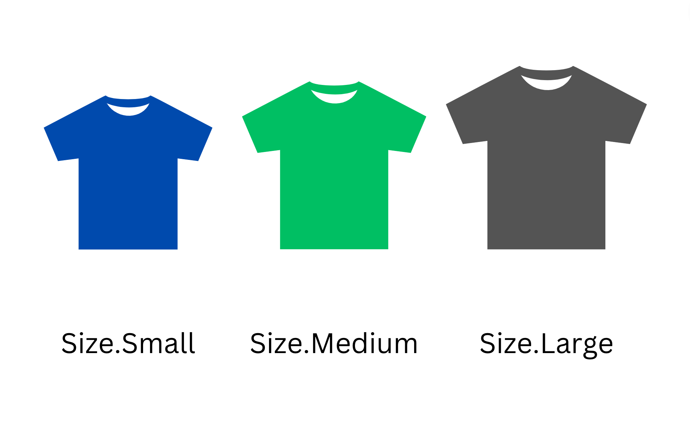

Strings and numbers have an infinite set of values, while others types like booleans are restricted to a finite set.  

The days of the week (Monday, Tuesday, ..., Sunday), seasons of the year (winter, spring, summer, autumn), and cardinal directions (north, east, south, west) are examples of sets with finite values.  

Using an [enum](https://en.wikipedia.org/wiki/Enumerated_type) is convenient when a variable has a value from a finite set of predefined constants. The enum saves you from using magic numbers and strings (which is considered an [antipattern](https://stackoverflow.com/questions/47882/what-is-a-magic-number-and-why-is-it-bad)).    

Let's see the 4 good ways to create enums in JavaScript (with their pros and cons).  

<Affiliate type="traversyJavaScript" />

<TableOfContents maxLevel={1} />

## 1. Enum based on a plain object

An enum is a data structure that defines a finite set of named constants. Each constant can be accessed by its name. 

Let's consider the sizes of a T-shirt: `Small`, `Medium`, and `Large`.  

A simple way (though not the most optimal, see the approaches below) to create an enum in JavaScript is to use a [plain JavaScript object](https://developer.mozilla.org/en-US/docs/Learn/JavaScript/Objects/Basics).  

```javascript
const Sizes = {
  Small: 'small',
  Medium: 'medium',
  Large: 'large',
}

const mySize = Sizes.Medium

console.log(mySize === Sizes.Medium) // logs true
```
[Open the demo.](https://jsfiddle.net/7e1od2r4/)

`Sizes` is an enum based on a plain JavaScript object which has 3 named constants: `Sizes.Small`, `Sizes.Medium`, and `Sizes.Large`. 

`Sizes` is also a string enum because the values of the named constants are strings: `'small'`, `'medium'`, and `'large'`.  

<ImgShadow>

</ImgShadow>

To access the named constant value use the  [property accessor](/access-object-properties-javascript/#1-dot-property-accessor). For example the value of `Sizes.Medium` is `'medium'`.  

The enum is more readable, more explicit, and removes the use of magic strings or numbers.  

### Pros and cons

The plain object enum is attractive because of its simplicity: just define an object with keys and values, and the enum is ready.  

But in a large codebase someone might accidentally modify the enum object and this will affect the runtime of the application.    

```javascript
const Sizes = {
  Small: 'small',
  Medium: 'medium',
  Large: 'large',
}

const size1 = Sizes.Medium
const size2 = Sizes.Medium = 'foo' // Changed!

console.log(size1 === Sizes.Medium) // logs false
```
[Open the demo.](https://jsfiddle.net/r7gyth1p/)

`Sizes.Medium` enum value was accidentally changed. 

`size1`, while being initialized with `Sizes.Medium`, no longer equals `Sizes.Medium`!  

The plain object implementation is not protected from such accidental changes. 

Let's take a closer look at string and symbol enums. And then how to freeze the enum object to avoid the accidental change problem.  

## 2. Enum value types

Besides the string type, the value of an enum can be a number:

```javascript
const Sizes = {
  Small: 0,
  Medium: 1,
  Large: 2
}

const mySize = Sizes.Medium

console.log(mySize === Sizes.Medium) // logs true
```
[Open the demo.](https://jsfiddle.net/se71ygvd/)

`Sizes` enum in the above example is an numeric enum because the values are numbers: `0`, `1`, `2`.  

You can also create a symbol enum:

```javascript
const Sizes = {
  Small: Symbol('small'),
  Medium: Symbol('medium'),
  Large: Symbol('large')
}

const mySize = Sizes.Medium

console.log(mySize === Sizes.Medium) // logs true
```
[Open the demo.](https://jsfiddle.net/dzsgrf4c/)

The benefit of using a symbol is that [each symbol is unique](https://javascript.info/symbol#symbols). This means that you will always have to compare enums by using the enum itself:

```javascript
const Sizes = {
  Small: Symbol('small'),
  Medium: Symbol('medium'),
  Large: Symbol('large')
}

const mySize = Sizes.Medium

console.log(mySize === Sizes.Medium)     // logs true
console.log(mySize === Symbol('medium')) // logs false
```
[Open the demo.](https://jsfiddle.net/pnzyqxms/)

The downside of using symbol enum is that `JSON.stringify()` stringifies symbols to either `null`, `undefined`, or skips the property having a symbol as a value:

```javascript
const Sizes = {
  Small: Symbol('small'),
  Medium: Symbol('medium'),
  Large: Symbol('large')
}

const str1 = JSON.stringify(Sizes.Small)
console.log(str1) // logs undefined

const str2 = JSON.stringify([Sizes.Small])
console.log(str2) // logs '[null]'

const str3 = JSON.stringify({ size: Sizes.Small })
console.log(str3) // logs '{}'
```
[Open the demo.](https://jsfiddle.net/n5w2bkj4/)

In the following examples, I will use string enums. But you are free to use whatever value type you need. 

If you are free to choose the enum value type, just go with the strings. Strings are easier to debug than numbers and symbols.  

## 3. Enum based on Object.freeze()

A good way to protect the enum object from modifications is to freeze it. When an object is frozen, you cannot modify or add new properties to the object. In other words, the object becomes read-only.  

In JavaScript, [Object.freeze()](https://developer.mozilla.org/en-US/docs/Web/JavaScript/Reference/Global_Objects/Object/freeze) utility function freezes an object. Let's freeze the sizes enum:

```javascript
const Sizes = Object.freeze({
  Small: 'small',
  Medium: 'medium',
  Large: 'large',
})

const mySize = Sizes.Medium

console.log(mySize === Sizes.Medium) // logs true
```
[Open the demo.](https://jsfiddle.net/mbgj3tu0/)

`const Sizes = Object.freeze({ ... })` creates a frozen object. Even being frozen, you can freely access the enum values: `const mySize = Sizes.Medium`.  

### Pros and cons

If an enum property has been accidentally changed, JavaScript throws an error (in [strict mode](https://developer.mozilla.org/en-US/docs/Web/JavaScript/Reference/Strict_mode)):  

```javascript
const Sizes = Object.freeze({
  Small: 'Small',
  Medium: 'Medium',
  Large: 'Large',
})

const size1 = Sizes.Medium
const size2 = Sizes.Medium = 'foo' // throws TypeError
```
[Open the demo.](https://jsfiddle.net/svu1go3k/1/)

The statement `const size2 = Sizes.Medium = 'foo'` makes an accidental assignment to `Sizes.Medium` property. 

Because `Sizes` is a frozen object, JavaScript (in [strict mode](https://developer.mozilla.org/en-US/docs/Web/JavaScript/Reference/Strict_mode)) throws the error:

```
TypeError: Cannot assign to read only property 'Medium' of object <Object>
```

The frozen object enum is protected from accidental changes.  

Still, there's another issue. If you accidentally misspell the enum constant, then the result will be `undefined`:

```javascript
const Sizes = Object.freeze({
  Small: 'small',
  Medium: 'medium',
  Large: 'large',
})

console.log(Sizes.Med1um) // logs undefined
```
[Open the demo.](https://jsfiddle.net/6ywL1xzu/)

`Sizes.Med1um` expression (`Med1um` is a misspelled version of `Medium`) evaluates to `undefined` rather than throwing an error about the non-existent enum constant.  

Let's see how a proxy-based enum can solve even this problem.  

## 4. Enum based on a proxy

An interesting, and my favourite implementation, are enums based on [proxies](https://developer.mozilla.org/en-US/docs/Web/JavaScript/Reference/Global_Objects/Proxy).  

A proxy is a special object that wraps an object to modify the behaviour of operations on the original object. The proxy doesn't change the structure of the original object.  

The enum proxy intercepts the read and write operations on an enum object and:

* Throws an error when a non-existent enum value is accessed
* Throws an error when an enum object property is changed

Here's an implementation of a factory function that accepts a plain enum object, and returns a proxied object:

```javascript
// enum.js
export function Enum(baseEnum) {  
  return new Proxy(baseEnum, {
    get(target, name) {
      if (!baseEnum.hasOwnProperty(name)) {
        throw new Error(`"${name}" value does not exist in the enum`)
      }
      return baseEnum[name]
    },
    set(target, name, value) {
      throw new Error('Cannot add a new value to the enum')
    }
  })
}
```

`get()` method of the proxy intercepts the read operations and throws an error if the property name doesn't exist. 

`set()` method intercepts the write operations and just throws an error. It's designed to protect the enum object from write operations.  

Let's wrap the sizes object enum into a proxy:

```javascript
import { Enum } from './enum'

const Sizes = Enum({
  Small: 'small',
  Medium: 'medium',
  Large: 'large',
})

const mySize = Sizes.Medium

console.log(mySize === Sizes.Medium) // logs true
```
[Open the demo.](https://jsfiddle.net/ygas4z5v/4/)

The proxied enum works exactly like the plain object enum.  

### Pros and cons

However, the proxied enum is protected from accidental overwriting or accessing non-existent enum constants:

```javascript
import { Enum } from './enum'

const Sizes = Enum({
  Small: 'small',
  Medium: 'medium',
  Large: 'large',
})

const size1 = Sizes.Med1um         // throws Error: non-existing constant
const size2 = Sizes.Medium = 'foo' // throws Error: changing the enum
```
[Open the demo.](https://jsfiddle.net/jb1p2rhd/1/)

`Sizes.Med1um` throws an error because `Med1um` constat name does not exist on the enum. 

`Sizes.Medium = 'foo'` throws an error because the enum property has been changed.  

The downside of proxy enum is that you always have to import the `Enum` factory function and wrap your enum objects into it. 

## 5. Enum based on a class

Another interesting way to create an enum is using a [JavaScript class](/javascript-classes-complete-guide/).  

A class-based enum contains a set of [static fields](/javascript-classes-complete-guide/#33-public-static-fields), where each static field represents an enum named constant.  The value of each enum constant is itself an instance of the class.  

Let's implement the sizes enum using a class `Sizes`:

```javascript
class Sizes {
  static Small = new Sizes('small')
  static Medium = new Sizes('medium')
  static Large = new Sizes('large')
  #value

  constructor(value) {
    this.#value = value
  }

  toString() {
    return this.#value
  }
}

const mySize = Sizes.Small

console.log(mySize === Sizes.Small)  // logs true
console.log(mySize instanceof Sizes) // logs true
```
[Open the demo.](https://jsfiddle.net/vqoj32h6/)

`Sizes` is a class that represents the enum. The enum constants are static fields on the class, e.g. `static Small = new Season('small')`.

Each instance of the `Sizes` class also has a private field `#value`, which represents the raw value of the enum.  

A nice advantage of the class-based enum is the ability to determine at runtime whether the value is an enum using `instanceof` operation. For example, `mySize instanceof Sizes` evaluates to `true`, since `mySize` is an enum value.  

The class-based enum comparison is instance-based (rather primitive comparison in the case of plain, frozen, or proxied enums):

```javascript
class Sizes {
  static Small = new Sizes('small')
  static Medium = new Sizes('medium')
  static Large = new Sizes('large')
  #value

  constructor(value) {
    this.#value = value
  }

  toString() {
    return this.#value
  }
}

const mySize = Sizes.Small

console.log(mySize === new Sizes('small')) // logs false
```
[Open the demo.](https://jsfiddle.net/afev9zLt/)

`mySize` (that has `Sizes.Small`) isn't equal to `new Sizes('small')`. 

`Sizes.Small` and `new Sizes('small')`, even having the same `#value`, are different object instances. [See more](how-to-compare-objects-in-javascript/#1-referential-equality) about referential equality.

### Pros and cons

Class-based enums are not protected from overwriting or accessing a non-existent enum named constant.  

```javascript
class Sizes {
  static Small = new Sizes('small')
  static Medium = new Sizes('medium')
  static Large = new Sizes('large')
  #value

  constructor(value) {
    this.#value = value
  }

  toString() {
    return this.#value
  }
}

const size1 = Sizes.medium         // a non-existing enum value can be accessed
const size2 = Sizes.Medium = 'foo' // enum value can be overwritten accidentally
```
[Open the demo.](https://jsfiddle.net/afev9zLt/4/)

But you can control the creation of new instances, for example, by counting how many instances have been created inside the constructor. Then throw an error if more than 3 instances were created.  

Of course, it's better to keep your enum implementation as simple as possible. Enums are meant to be plain data structures.  

## 6. Conclusion

There are 4 good ways to create enums in JavaScript.  

The simplest way is to use a plain JavaScript object:

```javascript
const MyEnum = {
  Option1: 'option1',
  Option2: 'option2',
  Option3: 'option3'
}
```

The plain object enum object fits best for small projects or quick demos.  

The second option, if you want to protect the enum object from accidental overwriting, is to use a frozen plain object:

```javascript
const MyEnum = Object.freeze({
  Option1: 'option1',
  Option2: 'option2',
  Option3: 'option3'
})
```

The frozen object enum is good for medium or large projects where you want to be sure the enum won't be changed accidentally.  

The third option is the proxy approach:

```javascript
export function Enum(baseEnum) {  
  return new Proxy(baseEnum, {
    get(target, name) {
      if (!baseEnum.hasOwnProperty(name)) {
        throw new Error(`"${name}" value does not exist in the enum`)
      }
      return baseEnum[name]
    },
    set(target, name, value) {
      throw new Error('Cannot add a new value to the enum')
    }
  })
}
```

```javascript
import { Enum } from './enum'

const MyEnum = Enum({
  Option1: 'option1',
  Option2: 'option2',
  Option3: 'option3'
})
```

The proxied enum is good for medium or large projects to protect even better your enums from overwriting or accessing non-existent named constants. 

The proxied enum is my personal preference.  

The fourth option is to use the class-based enum, where each named constant is an instance of the class and is stored as a static property of the class:

```javascript
class MyEnum {
  static Option1 = new Season('option1')
  static Option2 = new Season('option2')
  static Option3 = new Season('option3')
  #value

  constructor(value) {
    this.#value = value
  }

  toString() {
    return this.#value
  }
}
```

The class-based enum works if you like classes. However, the class-based enum is less protected than frozen or proxied enums.    

*What other ways to create enums in JavaScript do you know?*